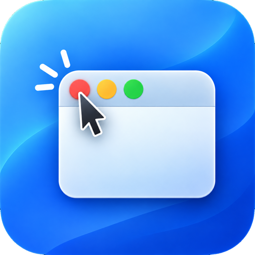

<div align="center">



# Last Call

**Close the last window, the app quits. Like Windows.**

<p>
<a href="https://github.com/Andx-Anderson/LastCall/actions/workflows/test.yml"></a>


<a href="https://github.com/Andx-Anderson/LastCall/releases/latest"></a>
<a href="LICENSE"></a>
</p>

</div>

---

Say hello to **Last Call**, the app that makes your Mac's red close button do what you actually
expect. Close an app's last window and the app *quits* — no more half a dozen apps idling in your
Dock with nothing open, no more reaching for Cmd+Q every single time.

And it works on **Discord**, which tools like this quietly fail on. Discord doesn't close its window,
it hides it, so anything waiting for a window to be destroyed waits forever. Last Call counts
windows instead. It also knows the difference between closing a window and *minimizing* one, or
leaving one open on another Space — so it never quits an app you're still using.

---

## Install

### Download

<a href="https://github.com/Andx-Anderson/LastCall/releases/latest/download/LastCall.dmg"></a>

Once downloaded, open the `.dmg` and move **Last Call** to your `/Applications` folder.

> [!IMPORTANT]
> There's no Developer ID behind this build yet, so macOS will warn you that Last Call is from an
> unidentified developer on first launch. This is expected behaviour.
>
> You'll need to bypass it before the app will open. You only need to do this once. Use one of the
> methods below.

---

**Recommended: Terminal (always works)**

This is the quickest method. It's a single command and works for everyone, including non-admin
users, which System Settings does not.

After moving Last Call to your Applications folder, run:

```sh
xattr -dr com.apple.quarantine /Applications/LastCall.app
```

Then open the app normally.

---

**Alternative: System Settings**

> [!NOTE]
> This method doesn't work for all users. If it doesn't work, use the Terminal method above.

1. Try to open the app — you'll see a security warning.
2. Click **OK** to dismiss it.
3. Open **System Settings** > **Privacy & Security**.
4. Scroll to the bottom and click **Open Anyway** next to the Last Call warning.
5. Confirm if prompted.

---

### Or build it yourself

```sh
git clone https://github.com/Andx-Anderson/LastCall.git
cd LastCall
./build.sh
```

Compiles it, installs it to `/Applications`, and launches it. No quarantine flag to clear, because
nothing was downloaded.

### Then grant permission

> [!IMPORTANT]
> Last Call needs **Accessibility** permission, and prompts you on first launch. It cannot see which
> window you clicked without it, so nothing works until you tick the box.
>
> System Settings → Privacy & Security → Accessibility → **Last Call**

---

## Use

A menu bar icon and one settings window. Apps quit when you close the last window with the **red
button** or **Cmd+W**.

| Setting | What it does |
| :--- | :--- |
| **Quit apps when the last window closes** | The main switch. |
| **Open at login** | A real Login Item, revocable in System Settings → General → Login Items. |
| **Never quit these apps** | Add any app with `+`. Finder is always excluded. |

The menu bar icon dims when it's paused or when permission is missing.

> [!TIP]
> It deliberately won't quit an app that still has a window on **another Space**, one whose only
> remaining window is **minimized**, or **Finder**. When the answer is ambiguous it leaves the app
> alone — the only thing it can do is quit something, so it errs toward doing nothing.

### Tested

| App | |
| :--- | :--- |
| Discord | quits — hides its window instead of closing it, the case other tools miss |
| Spotify | quits — slow close animation, handled by re-checking |
| ChatGPT | quits |
| Safari | quits on the last window; closing a **tab** correctly does nothing |
| Finder | never quit, by design |

Apps with a window on another Space, or with a minimized window left, are left running.

---

## Privacy

The event tap is **listen-only** and cannot alter or block input. The key handler reads only the
keycode and modifier flags, to test for Cmd+W. Nothing is stored, logged, or sent anywhere.

---

## Build

| File | |
| :--- | :--- |
| `Sources/Engine.swift` | Event tap, triggers, window counting |
| `Sources/Decision.swift` | The quit rule, kept pure so it can be tested |
| `Sources/Prefs.swift` | Settings and the login item |
| `Sources/SettingsView.swift` | Settings window |
| `Sources/AppDelegate.swift` | Menu bar |
| `Icon/mask.swift` | Regenerates the icon from the source art |

`./build.sh` compiles, bundles, signs and installs to `/Applications`.
`./test.sh` runs the decision tests — pure logic, so they need no running app and no permission.

> [!WARNING]
> Ad-hoc signing ties the Accessibility grant to the code hash, so **every rebuild silently voids
> it** — macOS keeps showing the toggle as enabled while denying the app. `build.sh` resets the grant
> on each build so you get an honest prompt instead of an app that looks authorised and does nothing.

---

## Notes

Why Discord needs different handling, and two designs that failed before this one:
**[DESIGN.md](DESIGN.md)**.

## License

MIT
